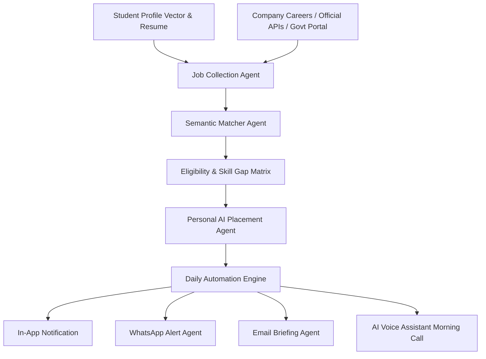

# AI Architecture & Agent Pipeline - PlacementOS AI

## 1. Multi-Agent System Overview (CrewAI & Flowise Integration)
**PlacementOS AI** operates a dedicated **Personal AI Placement Agent** for every student, backed by a multi-agent orchestration graph:

---

## 2. Personal AI Placement Agent Responsibilities
1. **Continuous Opportunity Monitoring**: Monitors newly ingested verified jobs every morning at 06:00 AM.
2. **Personalized Skill Match Index**: Computes semantic match ratio using cosine vector similarity of skills, projects, and target roles.
3. **Morning AI Voice Call Synthesis**: Calls student's device or renders interactive Web Speech audio summarizing tests, readiness score, and top 3 matching job openings.
4. **ATS Resume Optimization**: Parses resumes, checks section structures, keyword density, and generates tailored target resumes without inventing false data.

---

## 3. Placement Readiness Index Formula
$$\text{Readiness Index} = (0.25 \times \text{Skill Match}) + (0.15 \times \text{ATS Score}) + (0.15 \times \text{Project Index}) + (0.15 \times \text{Coding Streak}) + (0.15 \times \text{Mock Test}) + (0.15 \times \text{Interview Score})$$

---

## 4. AI Voice Call Assistant Pipeline
1. **Trigger**: Scheduled cron job at 07:00 AM daily.
2. **Context Engine**: Aggregates today's mock tests, interview schedules, readiness score, and top 3 job matches.
3. **Speech Synthesis**: Converts generated script to audio via Web Speech Synthesis API / ElevenLabs / Twilio Programmable Voice.
4. **Script Example**:
   > *"Good morning. This is Placement AI. Today you have a Zoho Mock Test at 10 AM. Please keep your laptop ready. Your current placement readiness score is 84%. Best wishes."*
